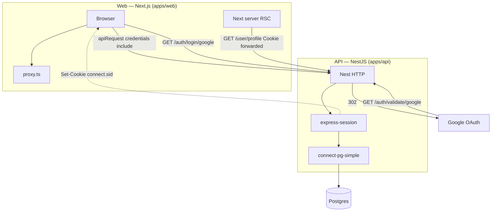

# Full-stack OAuth session demo

Full-stack Google OAuth with NestJS and Next.js, using **server-side sessions** stored in PostgreSQL.

Scope: clear, review-friendly example — not a full production platform. Configuration is explicit and validated at API startup; see **Production / deploy** below for what you’d still do on a real host.

## Tech Stack

- **Frontend**: Next.js (App Router), TypeScript, shadcn/ui-style components
- **Backend**: NestJS, TypeScript
- **Database**: PostgreSQL (TypeORM + Docker for local DB)
- **Auth**: Google OAuth 2.0, `express-session` + `connect-pg-simple`
- **Monorepo**: Turborepo, pnpm

## Prerequisites

- Node.js ≥ 20
- pnpm
- Docker (for local Postgres)

## Setup

### 1. Install dependencies

```bash
pnpm install
```

### 2. Session secret

```bash
openssl rand -base64 32
```

### 3. Environment variables

Copy `.env.example` to **`.env.local` at the repository root**. Both the API and the Next app load that file (Nest: `apps/api/src/app.module.ts`; web: `loadEnvConfig` in `apps/web/next.config.js`). You can still set the same keys in your host’s env UI for deploys.

Do not commit `.env`, `.env.local`, or real secrets; `.env.example` is the template only.

| Variable | Role |
| -------- | ---- |
| `DATABASE_URL` | Postgres connection string |
| `SESSION_SECRET` | Signs session cookies |
| `API_ORIGIN` | Public base URL of the **API** (no trailing slash); use for deploy docs / parity with `NEXT_PUBLIC_API_URL` |
| `GOOGLE_CALLBACK_URL` | **Full** OAuth redirect URI Passport sends to Google (must match Console **and** the callback route implemented on this API) |
| `GOOGLE_CLIENT_ID` / `GOOGLE_CLIENT_SECRET` | OAuth client credentials |
| `CLIENT_ORIGIN` | Public origin of the **Next** app (CORS + redirect after OAuth) |
| `NEXT_PUBLIC_API_URL` | Same API base URL as used in the browser (usually matches `API_ORIGIN`) |
| `NEXT_PUBLIC_APP_URL` | Optional canonical site URL for the Next app |
| `POSTGRES_*` | Docker Compose; align with `DATABASE_URL` |

### 4. Google OAuth

1. In [Google Cloud Console](https://console.cloud.google.com/), create or select a project.
2. Configure the OAuth consent screen (scopes, test users if external).
    - select User type (Internal or External) click Create
    - Fill in the App information details
    - On the Scopes page, click Add or Remove Scopes and select the minimum required scopes 
3. Create **OAuth 2.0 Client ID** (Web application).
4. Add an authorized redirect URI that matches **`GOOGLE_CALLBACK_URL`**
    - exactly (same as the `GET …/auth/validate/google` route on the API, e.g. `http://localhost:3000/auth/validate/google` locally).
5. Copy **Client ID** and **Client Secret** into `.env`.

Follow this [step by step guide](https://dev.to/idrisakintobi/a-step-by-step-guide-to-google-oauth2-authentication-with-javascript-and-bun-4he7) with screenshots.

## Running the app

**Database (Docker):**

```bash
docker compose up --build
```

**API + web:**

```bash
pnpm dev
```

[Turborepo](https://turbo.build/) runs **`@repo/api` `build` once** before starting dev servers (`dependsOn: ["^build"]` in [`turbo.json`](turbo.json)), so `packages/api/dist` exists before Nest and Next boot. You will see **`@repo/api#build`** (one-shot) and **`@repo/api#dev`** (`tsc --watch`) in the task list—that is expected.

- API: http://localhost:3000
- Web: http://localhost:4000

## Project structure

- `apps/api` — NestJS API (auth, user, feedback)
- `apps/web` — Next.js app; App Router groups `app/(public)/…` (e.g. `/signin`) and `app/(protected)/…` (e.g. `/profile`) — segment names in parentheses are **not** part of the URL. **`requireAuth()`** in [`lib/auth.ts`](apps/web/lib/auth.ts) gates protected RSCs (redirects to `/signin` if needed) and returns the **`User`**; it uses a React-cached profile fetch so layout + page in the **same request** share one `GET /user/profile`. Browser calls go through [`apps/web/lib/api.ts`](apps/web/lib/api.ts)
- `docs/` — extra notes (e.g. [`docs/auth-architecture.md`](docs/auth-architecture.md))
- `packages/api` — shared **TypeORM entities** (e.g. `User`, `Feedback`), **DTOs** for request bodies (class-validator / Nest `mapped-types`), and the public **`@repo/api`** package consumed by the API and typed imports in the web app
- `packages/typescript-config` — shared TS config (`extends` for apps)
- `packages/eslint-config` — shared ESLint config

## API routes

**Auth (public)**

- `GET /auth/login/google` — start OAuth
- `GET /auth/validate/google` — OAuth callback
- `GET /auth/logout` — destroy session; clears `connect.sid`

**User (session required)**

- `GET /user/profile` — current user
- `PUT /user/profile` — update profile

**Feedback (session required)**

- `POST /feedback` — body `{ "message": string }`; returns `202` with `{ id, status: "received" }`; message stored in Postgres (demo intake; production might enqueue for email/Slack).

## Features

- Google OAuth and server-side sessions (HttpOnly `connect.sid`, `SameSite=lax`, `secure` in production)
- Sessions persisted in Postgres (survive API restarts)
- Protected Next routes: `(protected)` layout calls **`requireAuth()`**; pages that need the user call it again for **`User`** — session lookup in [`lib/auth.ts`](apps/web/lib/auth.ts) is React-cached per request (one profile fetch)
- Profile read/update with validation
- Feedback submission persisted to the database
- TypeScript, ESLint, Prettier

There is **no** Next.js Route Handler API under `app/api/` — **all** OAuth, sessions, and protected JSON live in the **Nest** app (`apps/api`). Next only calls that API from the browser and from RSC (`fetch` with forwarded cookies).

## Auth flows (overview)

**Read this first:** diagram below; details in [`docs/auth-architecture.md`](docs/auth-architecture.md).

- **Next** — [`proxy.ts`](apps/web/proxy.ts): optimistic **`connect.sid`** check on matched routes (e.g. `/profile/:path*`). [`requireAuth()`](apps/web/lib/auth.ts): RSC gate via **`GET /user/profile`** with forwarded cookies (React-`cache()`’d). Browser: [`apiFetch` / `apiRequest`](apps/web/lib/api.ts) with `credentials: 'include'`.
- **Nest** — OAuth entry **`GET /auth/login/google`**, callback **`GET /auth/validate/google`**, [`SessionGuard`](apps/api/src/auth/guards/session.guard.ts) on private JSON routes, [`sanitizeRedirect`](apps/api/src/common/safe-path.util.ts) for post-login URLs.

## Security (backend)

Helmet, CORS restricted to `CLIENT_ORIGIN`, global validation pipe, session guard on private routes, [`ClassSerializerInterceptor`](https://docs.nestjs.com/techniques/serialization) + `@Exclude()` on entities to limit exposed fields. **Rate limiting** via [`@nestjs/throttler`](https://github.com/nestjs/throttler): default **60 requests / minute / IP** globally ([`apps/api/src/app.module.ts`](apps/api/src/app.module.ts)); **`/auth/*`** is **stricter (10 / minute)** except **`GET /auth/logout`** ([`apps/api/src/auth/auth.controller.ts`](apps/api/src/auth/auth.controller.ts)). If Google returns **`error=access_denied`**, see [`oauth-callback-error.middleware.ts`](apps/api/src/auth/middleware/oauth-callback-error.middleware.ts) and [`docs/auth-architecture.md`](docs/auth-architecture.md) (failure / edge behavior).

## Production / deploy

- **TLS**: terminate HTTPS at your reverse proxy or platform; session cookies already use `secure` when `NODE_ENV=production`.
- **OAuth**: register **production** `GOOGLE_CALLBACK_URL` and (if required) JavaScript origins in Google Cloud; keep `CLIENT_ORIGIN`, `API_ORIGIN`, and `NEXT_PUBLIC_API_URL` on real schemes/hosts (`https://…`).
- **Secrets**: generate a strong `SESSION_SECRET`; rotate if leaked.
- **Cross-subdomain cookies (optional):** locally, UI and API often differ by port; in production, if the web app and API use **different hosts** (e.g. `app.example.com` vs `api.example.com`), you typically set session **`cookie.domain`** / **`SameSite`** explicitly so the browser (and Next RSC cookie forwarding) behave as you intend — not wired in this demo.

## Auth, sessions, and cookies (cross-origin)

The **login session is owned by the Nest API**, not by Next.js. After Google OAuth, [`express-session`](https://github.com/expressjs/session) sets an HttpOnly cookie (default name **`connect.sid`**) on the **API origin**. [**connect-pg-simple**](https://github.com/voxpelli/node-connect-pg-simple) stores session rows in Postgres; it does **not** define the cookie—that comes from `express-session` (see [`apps/api/src/main.ts`](apps/api/src/main.ts)).

The web app calls the API with **`credentials: 'include'`** (via [`apps/web/lib/api.ts`](apps/web/lib/api.ts): **`apiRequest`** / **`apiFetch`**) so the browser sends that cookie on `localhost:3000` (or your deployed API URL). **`apiFetch`** centralizes **401/403** handling (registered from **`AuthProvider`**). For **server** rendering, [`requireAuth`](apps/web/lib/auth.ts) forwards **`cookies()`** to `GET /user/profile` so protected RSC layouts/pages can gate routes without a same-origin BFF; the **browser** still relies on client state + **`401`** for interactive flows. If `requireAuth` fails, it redirects to **`/signin?redirect=/profile`** (fixed path while `/profile` is the only protected segment).

The Next.js root **[`proxy.ts`](apps/web/proxy.ts)** is an **optimistic** gate; **`SessionGuard`** on the API is authoritative (**401**).

Two **separate deployable apps** (different origins in dev: web `:4000`, API `:3000`). Solid arrows: requests. Dashed: **`Set-Cookie`** on the API response.



## Out of scope / possible extensions

Not required to run or understand this repo; typical production follow-ups:

- **Sessions vs JWT:** server-side sessions fit a **single API** that owns auth (immediate revocation on logout). JWT as a session substitute adds tradeoffs; JWTs stay useful for **service-to-service** or third-party APIs without a shared session store.
- **Session storage & cookie behavior:** this demo uses **fixed `maxAge`** and Postgres via **connect-pg-simple**; at scale you might use **Redis** (or similar), **rolling** sessions, **distributed** rate limits (vs in-memory throttler), observability, and health checks.
- **Web data layer:** profile and other API state use plain **`fetch`** ([`apps/web/lib/api.ts`](apps/web/lib/api.ts)). **[TanStack Query](https://tanstack.com/query)** is a common upgrade for deduped requests, refetch-on-focus, and mutation invalidation.

## Architecture note

One NestJS app is enough for OAuth + profile + feedback. Splitting into microservices would be justified when multiple teams or scaling bottlenecks require it; async workflows (e.g. feedback → queue → worker) are the usual next step after a synchronous DB write.

**Manual check:** With Docker, API, and web running, open `http://localhost:4000/signin?redirect=%2Fprofile`, complete Google sign-in, and confirm you land on **`/profile`** on the web app.

## Scripts

```bash
pnpm dev             # Turbo: all dev tasks (API, web, @repo/api watch); builds shared package first
pnpm build           # Turbo: production build (API, web, packages)
pnpm format          # Prettier write
pnpm format:check    # Prettier check
pnpm lint            # ESLint (workspace packages that define `lint`)
pnpm check-types     # Turbo runs each package’s `check-types` script (web: `next typegen && tsc --noEmit`)
```
