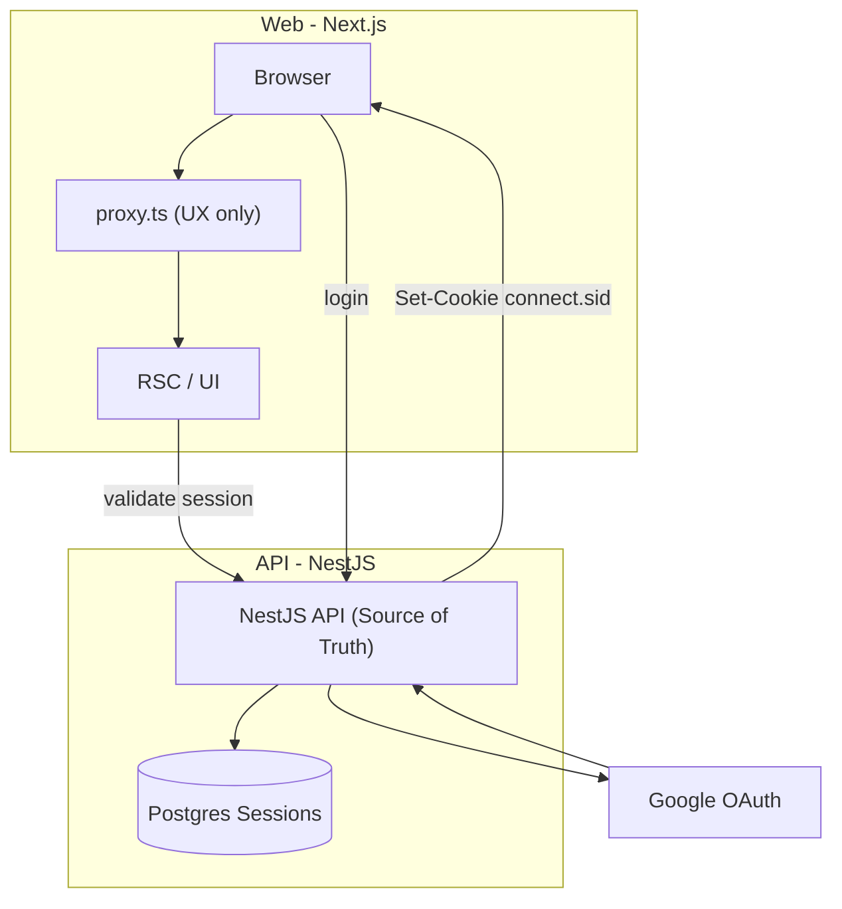

# Auth Architecture — NestJS API + Next.js (RSC)

Full-Stack Google OAuth across a **NestJS API** and **Next.js (RSC)**, using PostgreSQL-backed server-side sessions, clearly separated trust boundaries between Web and API  

> **Note:** This is a demonstration project, not a production SaaS. It focuses on clear architecture, security-aware defaults, and a runnable local setup.
>
> **Documentation**
>
> - **[`docs/decisions.md`](docs/decisions.md)** — Architecture decisions (trust boundary, proxy vs API, sessions, RSC)
> - **[`docs/tradeoffs.md`](docs/tradeoffs.md)** — Sessions vs JWT; API-owned vs Next-only
> - **[`docs/auth-architecture.md`](docs/auth-architecture.md)** — Step-by-step flows (ASCII), ownership, proxy vs API, RSC/client behavior, failure paths

## Key design

- **API (NestJS)** owns identity, sessions, and the OAuth flow.
- **Next.js (RSC)** handles UI and route guarding (`requireAuth()`, client fetches with `credentials: 'include'`).
- **Root proxy (`proxy.ts`)** is for UX redirects (cookie presence), not security—session validation happens on the API.
- **All data access** is gated with API session checks (`SessionGuard`, etc.).

Focused on auth boundaries, not feature completeness.

---

## Architecture

| Layer        | Technology                                                               |
| ------------ | ------------------------------------------------------------------------ |
| **Web**      | Next.js (App Router), TypeScript, `proxy.ts`, shadcn/ui-style components |
| **API**      | NestJS, Passport (Google), `express-session`, **connect-pg-simple**      |
| **Data**     | PostgreSQL, TypeORM, shared **`@repo/api`** package (entities + DTOs)    |
| **Monorepo** | Turborepo, pnpm                                                          |

**Auth flows (overview)** — diagram below. Rationale: [`docs/decisions.md`](docs/decisions.md). Flows & edges: [`docs/auth-architecture.md`](docs/auth-architecture.md).



---

## Repository structure

```text
.
├── apps/
│   ├── api/                 # NestJS — OAuth, user, feedback
│   └── web/                 # Next.js — App Router, proxy.ts, lib/auth.ts
├── docs/
│   ├── decisions.md           # Why (architecture decisions)
│   ├── tradeoffs.md           # Sessions vs JWT; API vs Next-only
│   └── auth-architecture.md   # How (flows, ownership, edges)
├── packages/
│   ├── api/                 # @repo/api — entities, DTOs, shared types
│   ├── eslint-config/
│   └── typescript-config/
├── docker-compose.yml
├── .env.example
├── package.json
└── turbo.json
```

---

## Prerequisites

- **Node.js** ≥ 20
- **pnpm**
- **Docker** (for local Postgres)

---

## Getting started

### 1. Clone and install

```bash
pnpm install
```

### 2. Session secret

```bash
openssl rand -base64 32
```

### 3. Environment

Copy **`.env.example`** to **`.env.local` at the repository root**. Both the API and Next load it (Nest: `apps/api/src/app.module.ts`; web: `loadEnvConfig` in `apps/web/next.config.js`).

Do not commit `.env`, `.env.local`, or real secrets.

| Variable                                    | Role                                                                              |
| ------------------------------------------- | --------------------------------------------------------------------------------- |
| `DATABASE_URL`                              | Postgres connection string                                                        |
| `SESSION_SECRET`                            | Signs session cookies                                                             |
| `API_ORIGIN`                                | Public API base URL (no trailing slash); aligns with `NEXT_PUBLIC_API_URL`        |
| `GOOGLE_CALLBACK_URL`                       | Full OAuth redirect URI (must match Google Console + `GET /auth/validate/google`) |
| `GOOGLE_CLIENT_ID` / `GOOGLE_CLIENT_SECRET` | OAuth credentials                                                                 |
| `CLIENT_ORIGIN`                             | Next app origin (CORS + post-login redirect)                                      |
| `NEXT_PUBLIC_API_URL`                       | API URL in the browser                                                            |
| `NEXT_PUBLIC_APP_URL`                       | Optional canonical web URL                                                        |
| `POSTGRES_*`                                | Docker Compose — align with `DATABASE_URL`                                        |

### 4. Google Cloud Console

1. Create/select a project in [Google Cloud Console](https://console.cloud.google.com/).
2. OAuth consent screen (scopes, test users if external).
3. Create **OAuth 2.0 Client ID** (Web application).
4. Authorized redirect URI = **`GOOGLE_CALLBACK_URL`** (e.g. `http://localhost:3000/auth/validate/google`).
5. Copy Client ID and Secret into `.env`.

### 5. Run Postgres

```bash
docker compose up --build
```

### 6. Run API + web

```bash
pnpm dev
```

| Service | URL (local)           |
| ------- | --------------------- |
| **API** | http://localhost:3000 |
| **Web** | http://localhost:4000 |

**Manual check:** With Docker + `pnpm dev`, open `http://localhost:4000/signin?redirect=%2Fprofile`, complete Google sign-in, land on **`/profile`**.

---

## API surface (Nest)

**Auth (public)**

- `GET /auth/login/google` — start OAuth
- `GET /auth/validate/google` — callback
- `GET /auth/logout` — destroy session; clears `connect.sid`

**User (session required)**

- `GET /user/profile` — current user
- `PUT /user/profile` — update profile

---

## Security (backend)

Helmet, CORS to **CLIENT_ORIGIN**, validation pipe, **SessionGuard**, and serialization via `ClassSerializerInterceptor` + `@Exclude()`.

Rate limits:
- 60/min/IP global
- `/auth/*`: 10/min (except logout)

---

## Production / deploy

- **TLS** at the edge; cookies use **`secure`** when `NODE_ENV=production`.
- **OAuth:** production `GOOGLE_CALLBACK_URL` + origins in Google Cloud; **`CLIENT_ORIGIN`**, **`API_ORIGIN`**, **`NEXT_PUBLIC_API_URL`** on real `https://` hosts.
- **Secrets:** strong **`SESSION_SECRET`**; rotate if leaked.
- **Cross-subdomain:** if web and API use different hosts, set session **`cookie.domain`** / **`SameSite`** explicitly — not wired in this demo.

---

## Out of scope / possible extensions

- **Sessions vs JWT** — see [`docs/tradeoffs.md`](docs/tradeoffs.md); this repo uses server-side sessions for browser→API auth; JWT is common for service-to-service / third-party APIs.
- **Scale** — Redis sessions, rolling sessions, observability, health checks.
- **Web** — plain **`fetch`** today; **[TanStack Query](https://tanstack.com/query)** for dedupe / refetch / invalidation.

---

## Scripts

```bash
pnpm dev             # Turbo: API, web, @repo/api watch; shared package builds first
pnpm build           # Production build
pnpm format          # Prettier write
pnpm format:check    # Prettier check
pnpm lint            # ESLint
pnpm check-types     # next typegen + tsc (web) + package checks
```

---

## License

Released under the [MIT License](LICENSE). Demonstration sample _focused on auth architecture exploration._
