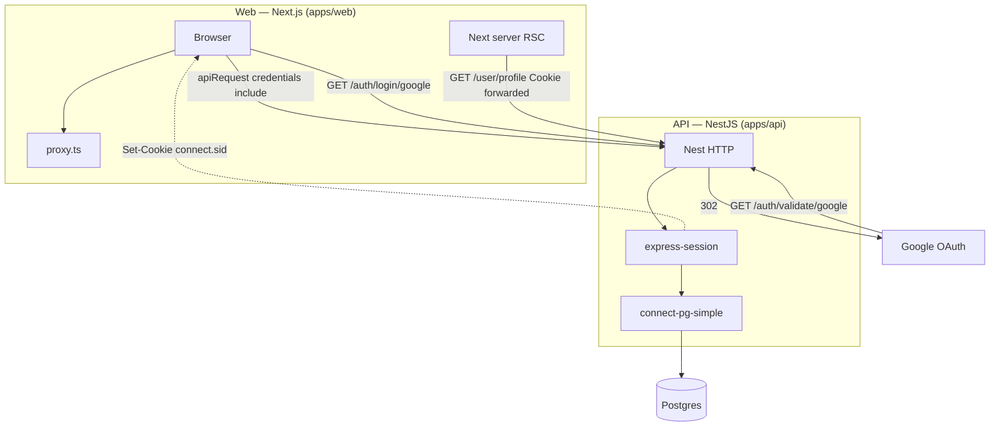

# Full-stack OAuth session demo

Full-stack **Google OAuth** with **NestJS** and **Next.js**, using **server-side sessions** stored in **PostgreSQL** (`express-session` + **connect-pg-simple**). The repo is a **review-friendly sample**: explicit config validation at API startup, two deployable apps (web + API), and documented auth boundaries.

> **Note:** This is a **portfolio / demonstration** project — not a production SaaS. The focus is clear architecture, security-aware defaults, and runnable local setup — not feature completeness.
>
> **Documentation**
>
> - **[`docs/auth-architecture.md`](docs/auth-architecture.md)** — Step-by-step flows (ASCII), ownership, proxy vs API authority, client/RSC behavior, failure paths

---

## Features

- Google OAuth and **HttpOnly** session cookies (`connect.sid`, `SameSite=lax`, `secure` in production)
- Sessions persisted in **Postgres** (survive API restarts)
- **Next.js** protected routes via `(protected)` + **`requireAuth()`** (RSC `GET /user/profile`, React-`cache()` dedupe)
- **Nest** **`SessionGuard`** on private APIs; **Helmet**, CORS, validation, serialization, **rate limits**
- Profile **read/update** + **feedback** intake (demo persistence)
- **TypeScript**, ESLint, Prettier, Turborepo monorepo

There is **no** Next.js Route Handler API under `app/api/` — **all** OAuth and session-backed JSON live in **`apps/api`**.

---

## Architecture

Two **separate origins** in local dev (web **:4000**, API **:3000**). The browser sends the session cookie to the API with **`credentials: 'include'`**; RSC forwards **`Cookie`** to the same API for **`GET /user/profile`**.

| Layer        | Technology                                                               |
| ------------ | ------------------------------------------------------------------------ |
| **Web**      | Next.js (App Router), TypeScript, `proxy.ts`, shadcn/ui-style components |
| **API**      | NestJS, Passport (Google), `express-session`, **connect-pg-simple**      |
| **Data**     | PostgreSQL, TypeORM, shared **`@repo/api`** package (entities + DTOs)    |
| **Monorepo** | Turborepo, pnpm                                                          |

**Auth flows (overview)** — **Read this first:** diagram below; full detail in [`docs/auth-architecture.md`](docs/auth-architecture.md).

- **Next** — [`proxy.ts`](apps/web/proxy.ts) (optimistic gate); [`requireAuth()`](apps/web/lib/auth.ts); [`apiFetch` / `apiRequest`](apps/web/lib/api.ts)
- **Nest** — `GET /auth/login/google`, `GET /auth/validate/google`, [`SessionGuard`](apps/api/src/auth/guards/session.guard.ts), [`sanitizeRedirect`](apps/api/src/common/safe-path.util.ts)

**Full detail** (ASCII flows, ownership, failure / edge behavior): [`docs/auth-architecture.md`](docs/auth-architecture.md).



_Same auth story with more narrative + edge cases:_ [`docs/auth-architecture.md`](docs/auth-architecture.md).

---

## Repository structure

```text
.
├── apps/
│   ├── api/                 # NestJS — OAuth, user, feedback
│   └── web/                 # Next.js — App Router, proxy.ts, lib/auth.ts
├── docs/
│   └── auth-architecture.md # Deep-dive auth flows & edges
├── packages/
│   ├── api/                 # @repo/api — entities, DTOs, shared types
│   ├── eslint-config/
│   └── typescript-config/
├── docker-compose.yml
├── .env.example
├── package.json
└── turbo.json
```

---

## Prerequisites

- **Node.js** ≥ 20
- **pnpm**
- **Docker** (for local Postgres)

---

## Getting started

### 1. Clone and install

```bash
pnpm install
```

### 2. Session secret

```bash
openssl rand -base64 32
```

### 3. Environment

Copy **`.env.example`** to **`.env.local` at the repository root**. Both the API and Next load it (Nest: `apps/api/src/app.module.ts`; web: `loadEnvConfig` in `apps/web/next.config.js`).

Do not commit `.env`, `.env.local`, or real secrets.

| Variable                                    | Role                                                                              |
| ------------------------------------------- | --------------------------------------------------------------------------------- |
| `DATABASE_URL`                              | Postgres connection string                                                        |
| `SESSION_SECRET`                            | Signs session cookies                                                             |
| `API_ORIGIN`                                | Public API base URL (no trailing slash); aligns with `NEXT_PUBLIC_API_URL`        |
| `GOOGLE_CALLBACK_URL`                       | Full OAuth redirect URI (must match Google Console + `GET /auth/validate/google`) |
| `GOOGLE_CLIENT_ID` / `GOOGLE_CLIENT_SECRET` | OAuth credentials                                                                 |
| `CLIENT_ORIGIN`                             | Next app origin (CORS + post-login redirect)                                      |
| `NEXT_PUBLIC_API_URL`                       | API URL in the browser                                                            |
| `NEXT_PUBLIC_APP_URL`                       | Optional canonical web URL                                                        |
| `POSTGRES_*`                                | Docker Compose — align with `DATABASE_URL`                                        |

### 4. Google Cloud Console

1. Create/select a project in [Google Cloud Console](https://console.cloud.google.com/).
2. OAuth consent screen (scopes, test users if external).
3. Create **OAuth 2.0 Client ID** (Web application).
4. Authorized redirect URI = **`GOOGLE_CALLBACK_URL`** (e.g. `http://localhost:3000/auth/validate/google`).
5. Copy Client ID and Secret into `.env`.

Optional walkthrough with screenshots: [dev.to guide](https://dev.to/idrisakintobi/a-step-by-step-guide-to-google-oauth2-authentication-with-javascript-and-bun-4he7).

### 5. Run Postgres

```bash
docker compose up --build
```

### 6. Run API + web

```bash
pnpm dev
```

[Turborepo](https://turbo.build/) runs **`@repo/api` `build` once** before dev (`dependsOn: ["^build"]` in [`turbo.json`](turbo.json)); `@repo/api#build` then `@repo/api#dev` in the task list is expected.

| Service | URL (local)           |
| ------- | --------------------- |
| **API** | http://localhost:3000 |
| **Web** | http://localhost:4000 |

---

## API surface (Nest)

**Auth (public)**

- `GET /auth/login/google` — start OAuth
- `GET /auth/validate/google` — callback
- `GET /auth/logout` — destroy session; clears `connect.sid`

**User (session required)**

- `GET /user/profile` — current user
- `PUT /user/profile` — update profile

**Feedback (session required)**

- `POST /feedback` — `{ "message": string }` → `202` + `{ id, status: "received" }`

---

## Security (backend)

Helmet, CORS to **`CLIENT_ORIGIN`**, validation pipe, **`SessionGuard`**, [`ClassSerializerInterceptor`](https://docs.nestjs.com/techniques/serialization) + `@Exclude()`. Rate limits: **60/min/IP** global ([`app.module.ts`](apps/api/src/app.module.ts)); **`/auth/*`** **10/min** except **`GET /auth/logout`** ([`auth.controller.ts`](apps/api/src/auth/auth.controller.ts)). Google **`error=access_denied`**: [`oauth-callback-error.middleware.ts`](apps/api/src/auth/middleware/oauth-callback-error.middleware.ts) + [`docs/auth-architecture.md`](docs/auth-architecture.md).

---

## Production / deploy

- **TLS** at the edge; cookies use **`secure`** when `NODE_ENV=production`.
- **OAuth:** production `GOOGLE_CALLBACK_URL` + origins in Google Cloud; **`CLIENT_ORIGIN`**, **`API_ORIGIN`**, **`NEXT_PUBLIC_API_URL`** on real `https://` hosts.
- **Secrets:** strong **`SESSION_SECRET`**; rotate if leaked.
- **Cross-subdomain:** if web and API use different hosts, set session **`cookie.domain`** / **`SameSite`** explicitly — not wired in this demo.

---

## Auth, sessions, cross-origin (summary)

The **session is owned by the Nest API** (`connect.sid` on the **API origin**). **connect-pg-simple** stores rows; it does not define the cookie ([`main.ts`](apps/api/src/main.ts)). **`apiFetch`** handles **401/403** via **`AuthProvider`**. **`requireAuth`** forwards **`cookies()`** for RSC; on failure redirects to **`/signin?redirect=/profile`** (fixed while only `/profile` is protected). **`proxy.ts`** is optimistic; **`SessionGuard`** is authoritative.

---

## Out of scope / possible extensions

- **Sessions vs JWT** — server-side sessions for a single API; JWT for service-to-service / third-party APIs.
- **Scale** — Redis sessions, rolling sessions, distributed rate limits, observability, health checks.
- **Web** — plain **`fetch`** today; **[TanStack Query](https://tanstack.com/query)** for dedupe / refetch / invalidation.

---

## Architecture note

One NestJS app is enough for OAuth + profile + feedback; microservices only if team/scale justify it. Feedback might later move async (queue + worker).

**Manual check:** With Docker + `pnpm dev`, open `http://localhost:4000/signin?redirect=%2Fprofile`, complete Google sign-in, land on **`/profile`**.

---

## Scripts

```bash
pnpm dev             # Turbo: API, web, @repo/api watch; shared package builds first
pnpm build           # Production build
pnpm format          # Prettier write
pnpm format:check    # Prettier check
pnpm lint            # ESLint
pnpm check-types     # next typegen + tsc (web) + package checks
```

---

## Author

- Website: [vzkiss.com](https://www.vzkiss.com)
- GitHub: [@vzkiss](https://github.com/vzkiss)

---

## License

Released under the [MIT License](LICENSE). This repository is a **portfolio / demonstration** sample; it is provided **as-is** without warranty.
