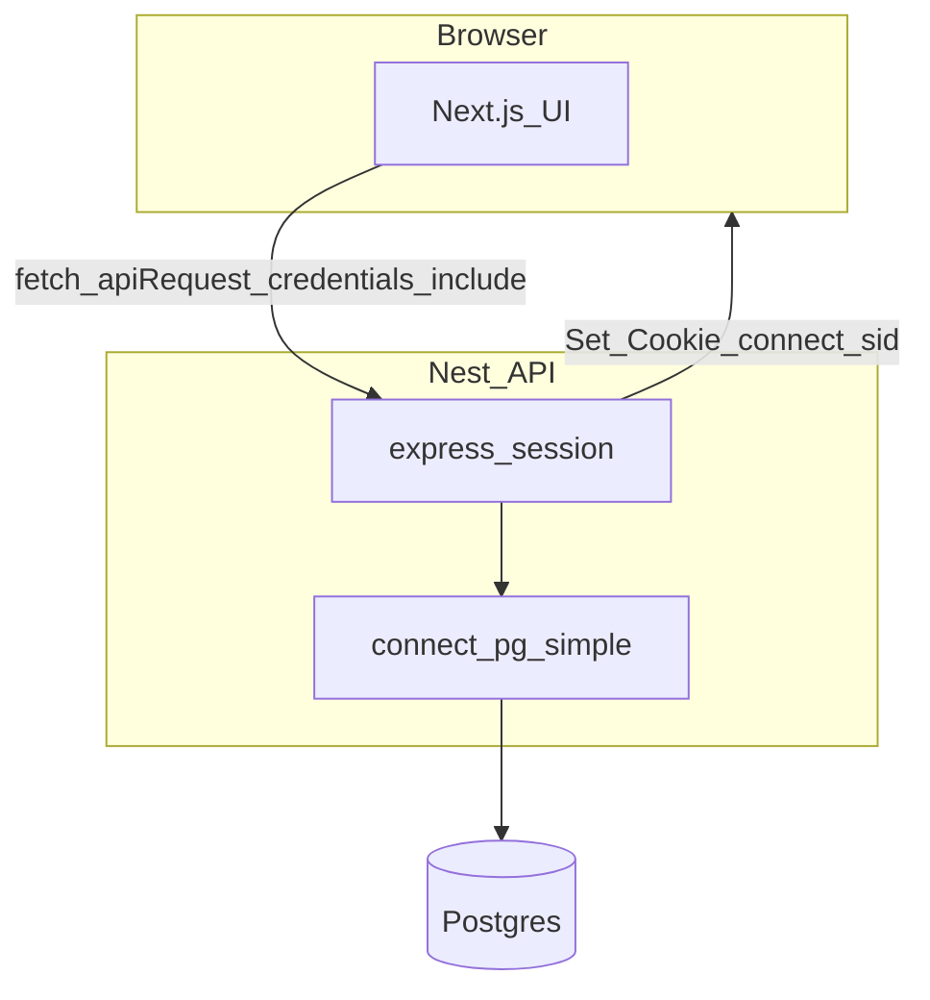

# XBorg Technical Challenge

Full-stack Google OAuth with NestJS and Next.js, using **server-side sessions** stored in PostgreSQL.

Scope: clear, review-friendly example — not a full production platform. Configuration is explicit and validated at API startup; see **Production / deploy** below for what you’d still do on a real host.

## Tech Stack

- **Frontend**: Next.js (App Router), TypeScript, shadcn/ui-style components
- **Backend**: NestJS, TypeScript
- **Database**: PostgreSQL (TypeORM + Docker for local DB)
- **Auth**: Google OAuth 2.0, `express-session` + `connect-pg-simple`
- **Monorepo**: Turborepo, pnpm

## Prerequisites

Challenge brief: [XBorg tech challenge](https://xborg.notion.site/tech-challenge)

- Node.js ≥ 20
- pnpm
- Docker (for local Postgres)

## Setup

### 1. Install dependencies

```bash
pnpm install
```

### 2. Session secret

```bash
openssl rand -base64 32
```

### 3. Environment variables

Copy `.env.example` to **`.env.local` at the repository root**. Both the API and the Next app load that file (Nest: `apps/api/src/app.module.ts`; web: `loadEnvConfig` in `apps/web/next.config.js`). You can still set the same keys in your host’s env UI for deploys.

Do not commit `.env`, `.env.local`, or real secrets; `.env.example` is the template only.

| Variable | Role |
| -------- | ---- |
| `DATABASE_URL` | Postgres connection string |
| `SESSION_SECRET` | Signs session cookies |
| `API_ORIGIN` | Public base URL of the **API** (no trailing slash); use for deploy docs / parity with `NEXT_PUBLIC_API_URL` |
| `GOOGLE_CALLBACK_URL` | **Full** OAuth redirect URI Passport sends to Google (must match Console **and** the callback route implemented on this API) |
| `GOOGLE_CLIENT_ID` / `GOOGLE_CLIENT_SECRET` | OAuth client credentials |
| `CLIENT_ORIGIN` | Public origin of the **Next** app (CORS + redirect after OAuth) |
| `NEXT_PUBLIC_API_URL` | Same API base URL as used in the browser (usually matches `API_ORIGIN`) |
| `NEXT_PUBLIC_APP_URL` | Optional canonical site URL for the Next app |
| `POSTGRES_*` | Docker Compose; align with `DATABASE_URL` |

### 4. Google OAuth

1. In [Google Cloud Console](https://console.cloud.google.com/), create or select a project.
2. Configure the OAuth consent screen (scopes, test users if external).
3. Create **OAuth 2.0 Client ID** (Web application).
4. Add an authorized redirect URI that matches **`GOOGLE_CALLBACK_URL`** exactly (same as the `GET …/auth/validate/google` route on the API, e.g. `http://localhost:3000/auth/validate/google` locally).
5. Copy **Client ID** and **Client Secret** into `.env`.

## Running the app

**Database (Docker):**

```bash
docker compose up --build
```

**API + web:**

```bash
pnpm dev
```

- API: http://localhost:3000
- Web: http://localhost:4000

## Project structure

- `apps/api` — NestJS API (auth, user, feedback)
- `apps/web` — Next.js app (sign-in, profile, feedback modal); API calls go through [`apps/web/lib/api.ts`](apps/web/lib/api.ts)
- `docs/` — extra notes (e.g. [`docs/auth-architecture.md`](docs/auth-architecture.md))
- `packages/typescript-config` — shared TS config (`extends` for apps)
- `packages/eslint-config` — shared ESLint config

## API routes

**Auth (public)**

- `GET /auth/login/google` — start OAuth
- `GET /auth/validate/google` — OAuth callback
- `GET /auth/logout` — destroy session; clears `connect.sid`

**User (session required)**

- `GET /user/profile` — current user
- `PUT /user/profile` — update profile

**Feedback (session required)**

- `POST /feedback` — body `{ "message": string }`; returns `202` with `{ id, status: "received" }`; message stored in Postgres (demo intake; production might enqueue for email/Slack).

## Features

- Google OAuth and server-side sessions (HttpOnly `connect.sid`, `SameSite=lax`, `secure` in production)
- Sessions persisted in Postgres (survive API restarts)
- Profile read/update with validation
- Feedback submission persisted to the database
- TypeScript, ESLint, Prettier

## Security (backend)

Helmet, CORS restricted to `CLIENT_ORIGIN`, global validation pipe, session guard on private routes, serialized entities to limit exposed fields. **`/auth/*`** routes (except **`GET /auth/logout`**) are **rate-limited** (30 requests / minute / IP via [`@nestjs/throttler`](https://github.com/nestjs/throttler)); tune in [`apps/api/src/app.module.ts`](apps/api/src/app.module.ts) and [`apps/api/src/auth/auth.controller.ts`](apps/api/src/auth/auth.controller.ts). If Google returns **`error=access_denied`** (user cancelled consent), the API **redirects** to **`CLIENT_ORIGIN/signin?oauth=cancelled`** (and preserves **`redirect`** when it was stored in session).

## Sessions vs JWT

Sessions fit a **single API** that owns auth: revocation is immediate on logout, and the browser only holds a session id cookie. JWT as a _session substitute_ adds signing, expiry, and revocation tradeoffs that rarely pay off at this scale; JWTs remain useful for **service-to-service** or third-party API access where no shared session store exists.

**Production extras** you’d typically add: Redis (or similar) for sessions at scale, stricter or distributed rate limits (in-memory throttler resets on restart; use Redis storage for multiple instances), observability, stricter cookie policy review.

### Production / deploy

- **TLS**: terminate HTTPS at your reverse proxy or platform; session cookies already use `secure` when `NODE_ENV=production`.
- **OAuth**: register **production** `GOOGLE_CALLBACK_URL` and (if required) JavaScript origins in Google Cloud; keep `CLIENT_ORIGIN`, `API_ORIGIN`, and `NEXT_PUBLIC_API_URL` on real schemes/hosts (`https://…`).
- **Secrets**: generate a strong `SESSION_SECRET`; rotate if leaked.
- **Optional at scale**: Redis-backed sessions, distributed rate limiting, structured logging, health checks — not required to understand or run this repo.

## Auth, sessions, and cookies (cross-origin)

The **login session is owned by the Nest API**, not by Next.js. After Google OAuth, [`express-session`](https://github.com/expressjs/session) sets an HttpOnly cookie (default name **`connect.sid`**) on the **API origin**. [**connect-pg-simple**](https://github.com/voxpelli/node-connect-pg-simple) stores session rows in Postgres; it does **not** define the cookie—that comes from `express-session` (see [`apps/api/src/main.ts`](apps/api/src/main.ts)).

The web app calls the API with **`credentials: 'include'`** (via [`apps/web/lib/api.ts`](apps/web/lib/api.ts): **`apiRequest`** / **`apiFetch`**) so the browser sends that cookie on `localhost:3000` (or your deployed API URL). **`apiFetch`** centralizes **401/403** handling (registered from **`AuthProvider`**). Next **Server Components** do not automatically see the API session cookie unless you add a BFF or same-origin proxy; client state + API **`401`** responses are the practical source of truth for the UI.

If you use [`apps/web/proxy.ts`](apps/web/proxy.ts), treat it as an **optimistic** gate (e.g. cookie present on the Next request). It cannot know whether the session row still exists in the database—**`SessionGuard` on the API** enforces that and returns **`401`** when the session is invalid. The client clears local auth state and redirects to sign-in when it receives **`401` / `403`** on authenticated calls.

More detail (draft): [`docs/auth-architecture.md`](docs/auth-architecture.md).



## Architecture note

One NestJS app is enough for OAuth + profile + feedback. Splitting into microservices would be justified when multiple teams or scaling bottlenecks require it; async workflows (e.g. feedback → queue → worker) are the usual next step after a synchronous DB write.

## OAuth redirect flow

1. The user hits Next.js **`/signin`**, optionally with **`?redirect=`** (for example after [`apps/web/proxy.ts`](apps/web/proxy.ts) sends unauthenticated visitors from a protected route to `/signin?redirect=…`).
2. **Sign in with Google** navigates the browser to **`GET /auth/login/google`** on the API (with the same `redirect` query when present). The API stores a **sanitized** post-login path in the session (`postLoginRedirect`) and starts Passport with **`state: true`**, so Google receives a **random OAuth `state`** nonce tied to that session.
3. Google redirects to **`GET /auth/validate/google`**, which must match **`GOOGLE_CALLBACK_URL`** and the Google Console authorized redirect URI.
4. The API validates the OAuth `state`, completes Google sign-in, sets **`session.userId`**, reads **`postLoginRedirect`**, and responds with **`302`** to **`CLIENT_ORIGIN` + path** (default **`/profile`** if `redirect` was omitted or invalid). There is no separate Next.js OAuth callback page.

Post-login paths are normalized in **`@repo/dto`** (`sanitizePostLoginRedirect`) so redirects stay same-origin (no open redirect).

```text
[ Next.js /signin?redirect=/profile ]
              ↓
[ Nest GET /auth/login/google ]
              ↓  session: postLoginRedirect + OAuth state nonce
[ Google ]
              ↓
[ Nest GET /auth/validate/google ]
              ↓
✔ session user id · Set-Cookie connect.sid
              ↓
302 → CLIENT_ORIGIN + /profile (or other sanitized path)
```

**Manual check:** With the API and web dev servers running, open `http://localhost:4000/signin?redirect=%2Fprofile`, finish Google sign-in, and confirm the browser lands on **`/profile`** on the web app.

## Scripts

```bash
pnpm format          # Prettier write
pnpm format:check    # Prettier check
pnpm lint            # ESLint (all packages)
pnpm check-types     # Typecheck
```