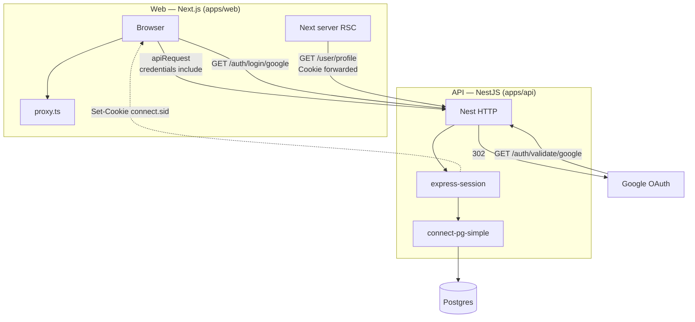

# Auth architecture

Step-by-step **how** this repo wires auth: flows, files, and edge behavior.

**Why** these choices exist: [decisions.md](decisions.md). **Options compared:** [tradeoffs.md](tradeoffs.md). Root [README](../README.md): **Key design**, high-level diagram, env and runbook.

## Detailed component diagram

Maps **apps/web** vs **apps/api** internals: browser and RSC traffic to Nest, OAuth redirects, **express-session** + **connect-pg-simple** → Postgres, and **Set-Cookie**. For route-by-route ASCII, see **Step-by-step flows** below.



## Step-by-step flows (Web vs API)

Paths match this repo (`/signin`, `GET /auth/login/google`, `GET /auth/validate/google`). Replace origins with your deploy URLs (`CLIENT_ORIGIN`, `NEXT_PUBLIC_API_URL` / `API_ORIGIN`).

### Web (Next.js)

```text
User → GET /profile
  ↓
proxy.ts (Next 16 root proxy; matcher: /profile/:path*)
  - checks for connect.sid on this request (optimistic; session row may be gone)
  - no cookie → redirect → /signin?redirect=/profile (redirect preserves pathname + search)
  ↓
/signin
  ↓
User clicks “Continue with Google”
  ↓
browser navigates to API (leaves Next):
  GET {API}/auth/login/google?redirect=...   (optional; derived from /signin?redirect=...)
  ↓
… → NestJS + Google (see below)
```

### API (NestJS + Google OAuth)

```text
GET /auth/login/google?redirect=/profile
  ↓
sanitizeRedirect(raw) → safe same-origin path; stored on session as postLoginRedirect
  Passport (state: true) adds an OAuth state nonce (CSRF protection), separate from `postLoginRedirect`.
  ↓
302 → Google consent screen
```

### Google → API callback

```text
Google → GET /auth/validate/google?…   (must match GOOGLE_CALLBACK_URL + Google Console)
  ↓
NestJS:
  - validate OAuth state / complete Google strategy
  - create or load user; session.userId = user.id
  - express-session sets HttpOnly connect.sid (API origin); connect-pg-simple persists session row
  - read postLoginRedirect from session; sanitizeRedirect again; clear postLoginRedirect
  ↓
302 → {CLIENT_ORIGIN}/profile   (or other sanitized path)
```

### Back to Web (Next.js)

```text
User lands on /profile (Next)
  ↓
app/(protected)/layout.tsx + page (RSC)
  ↓
requireAuth()
  ↓
cached auth() → GET /user/profile on API (cookies forwarded from RSC)
  ↓
200 + User → render protected UI
```

Client-side calls use [`apiFetch`](../apps/web/lib/api.ts) (`credentials: 'include'`); **`SessionGuard`** on the API is the source of truth for **401** if the session is invalid.

### What each service owns

|                        | Next.js (`apps/web`)                                                                                            | NestJS (`apps/api`)                                                                       |
| ---------------------- | --------------------------------------------------------------------------------------------------------------- | ----------------------------------------------------------------------------------------- |
| **Role**               | UX, optimistic route gate (`proxy.ts`), sign-in page, RSC guard (`requireAuth`), UI                             | OAuth with Google, session cookie + DB store, **`sanitizeRedirect`**, post-login redirect |
| **Critical guarantee** | User should not get a stable protected UI without the API accepting the session (RSC + client **401** handling) | **Redirect targets are safe** (no open redirect); identity and session creation           |

If Google returns **`error=access_denied`**, middleware redirects to **`/signin?oauth=cancelled`** ([`oauth-callback-error.middleware.ts`](../apps/api/src/auth/middleware/oauth-callback-error.middleware.ts)); details also under **Failure / edge** at the end of this document.

## Cookie (connect.sid)

- Default cookie from **express-session**
- Set by the **Nest API** after login
- Stored in Postgres via **connect-pg-simple** (store only; does not define the cookie)

## Browser ↔ two origins

Locally, UI is often `http://localhost:4000` and API `http://localhost:3000`. The web app uses `fetch(..., { credentials: 'include' })` (centralized in [`apps/web/lib/api.ts`](../apps/web/lib/api.ts)) so the browser attaches the session cookie to **API** requests.

**Server Components:** [`lib/auth.ts`](../apps/web/lib/auth.ts) forwards `cookies()` from `next/headers` to **`GET /user/profile`** on the API. **`requireAuth()`** redirects to **`/signin`** when invalid and returns **`User`** when valid, so **`app/(protected)/layout.tsx`** and nested pages **dedupe** the profile fetch. Protected UI still hydrates with **`AuthProvider`** client state for interactive flows.

## Next.js `proxy.ts`

`apps/web/proxy.ts` is the Next 16 root proxy (edge-style gate before the App Router).

Checks based only on `connect.sid` are **optimistic** — they cannot verify if the session still exists in Postgres.  
The API (`SessionGuard`) is the source of truth.

### Navigation behavior

- **Document request (`GET /profile`)** → redirected immediately if no cookie
- **Client transition (`router.push`)** → page may briefly render before RSC redirect

Using `window.location.assign()` forces a full navigation (optional UX hardening).

## Client reconciliation

- `apiRequest` → low-level transport (used for logout)
- `apiFetch` → adds auth handling:
  - on 401/403 → clears user + redirects via `AuthProvider`
  - throws `ApiUnauthorizedError`

## Nest API defaults (Helmet, CORS, validation, serialization, rate limits)

Session checks (`SessionGuard`, OAuth) sit on top of global API wiring in [`main.ts`](../apps/api/src/main.ts) and [`app.module.ts`](../apps/api/src/app.module.ts):

- **Helmet** — default security-related HTTP headers.
- **CORS** — `origin` = **`CLIENT_ORIGIN`**, `credentials: true` (browser may send cookies to the API).
- **ValidationPipe** — global; DTOs define allowed input (`whitelist` / `forbidNonWhitelisted`).
- **ClassSerializerInterceptor** — response shaping; sensitive fields stay off the wire via `@Exclude()` on entities.
- **Rate limits** — [`@nestjs/throttler`](https://docs.nestjs.com/security/rate-limiting): **60/min per IP** globally; **`/auth/*`** uses a stricter per-route limit (**10/min**), with **`GET /auth/logout`** excluded via `@SkipThrottle()`.

## Contrast with “Next-native” auth

Next cannot read the Nest session store on its own. **`requireAuth()`** forwards cookies to the API instead of a local `getSession()`-style resolver. Why that boundary: [decisions.md](decisions.md) (§5).

## Protected layout and cache()

- `app/(protected)/layout.tsx` runs **`await requireAuth()`** (for the redirect side effect; return value unused) so the whole segment is gated.
- Nested pages (e.g. profile) run **`const user = await requireAuth()`** for props. React **`cache()`** on the session helper in **`lib/auth.ts`** ensures **one** `fetch` per request.

## Failure / edge behavior (short)

- **Expired or removed session row:** API returns **401**; **`apiFetch`** runs the session-invalid handler; RSC **`requireAuth`** redirects to **`/signin`** when profile fetch fails.
- **Tampered or unsafe redirect:** [`sanitizeRedirect`](../apps/api/src/common/safe-path.util.ts) on Nest falls back to a safe default (`/profile`).
- **User cancels Google:** **`error=access_denied`** → redirect to **`/signin?oauth=cancelled`** ([`oauth-callback-error.middleware.ts`](../apps/api/src/auth/middleware/oauth-callback-error.middleware.ts)).
